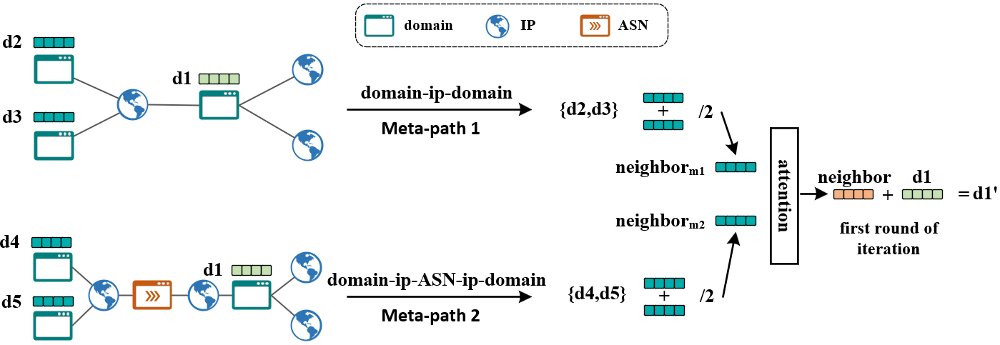
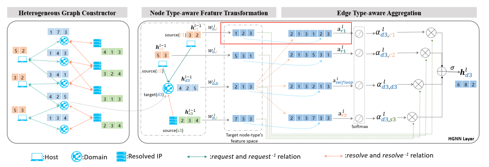

# Here is the code repository for the paper: "Graph-based Malicious Domain Name Detection: How to Use the Heuristic Relations".
This paper investigates how to effectively utilize relational patterns revealed during domain name resolution for graph-based malicious domain detection. We refer to these relational patterns as heuristic relations. 
(Please note that this implementation is not a complete, ready-to-use solution. As processing domain resolution relationships, extracting IP lists, and collecting supplementary IP-related information constitute data collection and preprocessing—which only require straightforward integration—subsequent researchers can compile the required datasets according to their needs. We provide only the core computational algorithms and will specify the input formats in detail to ensure researchers can directly implement this code.)

## Composition
This paper discusses a total of six typical graph-based methods for detecting malicious domains, including: BP, DeepDom, GAMD, Path-based Inference, LINE, and Node2Vec. 
Among these: 
-The LINE method employs the algorithm model from the DGL toolkit. 
-The Node2Vec method uses the original open-source code. 
(For both, we have provided detailed citation links in the paper.) 
The remaining four algorithms—BP, DeepDom, GAMD, and Path-based Inference—were reproduced by us following the original papers' guidelines. Therefore, we focus our reimplementation primarily on these four methods.

**(1)Path-based inference** 
This method is a reachable-path-based graph inference algorithm. Its core principle involves determining the existence of reachable paths between domain names in the graph, accumulating edge weights along these paths, and using the maximum path weight as the metric to infer the association strength between a domain and known malicious domains. 
The input data is a domain-relationship graph constructed using optimized Jaccard similarity coefficients derived from selected heuristic relations, where edge weights correspond to these coefficients. For example, in the dataset, if domain d₁ and domain d₂ resolve to two sets of IP addresses (IPs₁ and IPs₂, respectively), an edge exists between them if and only if IPs₁ and IPs₂ share common IPs; otherwise, no edge is formed. The edge weight is computed as follows: 

$$
w\left( d_1,d_2 \right) = 1- \frac{1}{1+heuristic\left( IPs_1 \cap IPs_2 \right)} 
$$

When pairwise relationships between all domain names in the dataset are computed, we obtain a graph structure representing their associations (*dom_ipw* in the code denotes the graph constructed from domain-resolved IPs). This structure is stored in a CSV file, with data formatted as illustrated in the following example table: 

| index | start | end | weight |
|:-------|:-------|:--------:|-------:|
|0  | d1 | d2  | 0.5 |
|1  | d4  | d5    | 0.667  |

Similarly, additional graph structures can be constructed based on IP auxiliary information such as ASN and internet service providers. The constructed graph data (formatted similarly to the table above) can be directly fed into the algorithm in pathinference.py to perform predictions for unlabeled domain names.

**(2)BP** 
The Belief Propagation (BP) algorithm is a message-passing inference method for probabilistic graphical models. Its core principle involves achieving global probability consensus through iterative local message exchanges between nodes. More specifically, BP propagates known labels from annotated nodes throughout the graph according to predefined inference rules, thereby estimating the probability distributions of unlabeled nodes. For our reimplementation, we employed Python's factorgraph toolkit to execute the BP algorithm. 
The core methodology consists of: (i) Initializing probability values to 0.99 for malicious domains and 0.01 for benign domains (this configuration prevents computational zeros that would occur with 0-valued initialization during multiplicative operations). (ii) Following the same computational procedure as the path-based inference approach to derive the domain relationship graph. (iii) Establishing inference relationships between adjacent nodes as specified in the following table:

| p(vi,vj) | vi=benign | vi=malicious |
|:-------|:-------|:--------:|
|vj=benign  | 0.51 | 0.49  | 
|vj=malicious  | 0.49 | 0.51  |

The fundamental heuristic is that domains adjacent to (or associated with) benign domains are more likely to be benign themselves, while those connected to malicious domains tend to be malicious. By iteratively propagating these inference relationships across the graph structure until convergence, we ultimately obtain prediction results for the domains. The graph data can be directly processed using the algorithm in bp.py, or users may adjust the inference rules within the code.

**(3)Deepdom** 
The method is an algorithm that utilizes graph neural networks for graph reasoning. Its core idea involves constructing an association graph between domain names based on various heuristic relationships. Due to the diversity of these relationships, the association graph contains not only domain name nodes but also other node types, such as IPs, subnets, CNAMEs, and ASNs, making it a heterogeneous graph. 
To address the challenges posed by heterogeneous graphs, the method employs a meta-path-guided random walk strategy to sample neighboring domain name nodes. For example, the meta-path "d1 - ip1 - d2" indicates that two domain names resolve to the same IP address. For any domain name *di* in the dataset, the goal is to identify all neighboring nodes *{dj,....}* that satisfy this relationship and then randomly select 5 nodes from them (padding with zeros if fewer than 5 are available). The features of these 5 neighboring nodes are averaged with those of *di*. 
Next, the node features sampled from different meta-paths are aggregated using an attention mechanism to generate the graph embedding of the node, as illustrated in the figure below (where only 2 neighbors are sampled for simplicity).

When reproducing this work, since the association graphs for each heuristic relationship (e.g.,*dom_ipw*, etc.) have already been generated, we can directly use these graphs for sampling. This approach is functionally equivalent to the random walk-guided sampling in DeepDom. Subsequently, we only need to: average the features of each node with those of its neighboring nodes, and concatenate the sampling results from different association graphs
before feeding them into the attention mechanism.

**(4)GAMD** 
We directly use the illustration from the literature to explain this algorithm. As shown in the figure below, the method employs two heuristic relationships—IP correlation and host correlation—to construct the graph structure while retaining both IP and host nodes, making it a heterogeneous graph. To address the heterogeneity, it trains separate attention mechanisms for each distinct relationship to perform feature fusion. The core approach still follows the logic of the GAT (Graph Attention Network) model, where the node itself and its neighbors are aggregated using an attention mechanism.

Therefore, when reproducing this method, we first construct single-relation association graphs based on different heuristic relationships. Next, we perform feature aggregation on each single-relation graph using a GAT, combine the results with the original features through averaging, and then fuse the aggregated representations from different heuristic relationships via attention mechanisms. This process is repeated until convergence (or until optimal performance is achieved).

**LINE,Node2Vec** 
The development of methods like LINE, Node2Vec, was partially inspired by advancements in natural language processing (NLP) models, but they incorporate graph-specific adaptations.

Node2Vec essentially adapts the Skip-gram model (from Word2Vec) to graphs by treating nodes as "words" and random walk sequences as "sentences." It uses negative sampling and hierarchical softmax, mirroring NLP techniques.

For LINE model, while it not explicitly derived from Word2Vec, it shares the distributional hypothesis principle (nodes with similar neighbors are similar, analogous to words in similar contexts). It optimizes first-order (direct edges) and second-order (shared neighbors) proximity, conceptually aligned with NLP's context windows.

The core idea of both methods is to generate node embeddings based on the graph structure, without considering the nodes' intrinsic attribute features. We utilized the open-source implementations of these two algorithms, so detailed code explanations will not be provided here. For specifics, please refer to the cited sections.

**Note** 
If you require technical support or have any other questions regarding the code, please feel free to contact us—we'd be happy to help.

